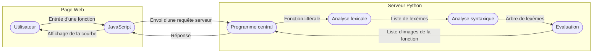

# Le Fantastique Expositeur Ultime de Résultat (FEUR)

<!-- Rapport du projet -->

> **Auteurs :** ALBERTOS Elvin, BEUNIER Gaspard *(Chef de projet)*, BIDAULT Arthur, BRUNEAU Geoffroy, BURET Antoine, CRINCKET Nathan, FLINOIS André-Mathys, MARTINEAU Paul, SALEK Adam et ZHU Yuzhe


Le **Fantastique Expositeur Ultime de Résultat (FEUR)** est un projet ayant pour but de **recréer une calculatrice graphique**. Ce projet, réalisé dans le contexte du module électif *"Techniques de programmation avancées"*, a été **entièrement réalisé par notre super équipe de 10**.

Pour notre calculatrice graphique, nous avons créé **un véritable site web**, hébergé en local avec un serveur Python qui s'occupe de réaliser toutes les analyses et les calculs nécessaires. Grâce à un **ingénieux système**, les fonction peuvent être entrées directement sur le site, elle feront l'objet d'une requête serveur qui répondra avec la discrétisation de la fonction. Le site affichera alors dynamiquement cette dernière. On peut donner comme exemple la fonction $\exp ( \cos ( x ) + 1 )$, pour laquelle le site affichera :


## Mise en place

**FEUR** fonctionne grâce à un serveur Python hébergé en local sur votre ordinateur grâce au framework *Flask*. C'est pourquoi, afin de tester notre **Fantastique Expositeur Ultime de Résultat**, il faut d'abord mettre en place le serveur :

#### Installation
Dans la section *"Releases"* du [GitHub du projet](https://github.com/1m0ut0n/fonc-exp-graph), téléchargez le fichier `feur-v1.zip` puis extrayez le sur un emplacement de votre ordinateur *(c'est le même que vous avez eu sur My Learning Space)*.
Vous pouvez aussi utiliser *git* pour télécharger le projet en entrant la commande suivante dans votre terminal :
```bash
> git clone https://github.com/1m0ut0n/fonc-exp-graph.git
```

#### Dépendances
Pour fonctionner, le projet utilise *Flask*, un framework de développement web en Python. C'est pourquoi pour utiliser **FEUR**, il est nécessaire d'avoir un environnement Python avec *pip*, que vous pouvez simplement installer en utilisant *[Miniconda](https://docs.conda.io/en/latest/miniconda.html#)* par exemple.

**⚠️ Il est indispensable de disposer au moins de Python 3.10.0 pour que le projet puisse fonctionner correctement !**

Lorsque que vous disposez des outils nécessaires, ouvrez l'invite de commande dans le dossier `feur-v1`. Vous pourrez alors installer simplement les bibliothèques Python nécessaires au projet grâce à la liste `requirements.txt` en utilisant la commande :
```bash
> pip install -r requirements.txt
```
Si vous préférez, vous pouvez installer *Flask* indépendamment puisque c'est la seule bibliothèque dont nous avons besoin :
```bash
> pip install Flask
```

#### Utilisation
Tout est maintenant prêt pour que vous puissiez utiliser **FEUR** ! Toujours dans le dossier `feur-v1` entrez la commande :
```bash
> python run.py
```
Vous verrez alors le serveur démarrer. Une fois le démarrage terminé, **assurez-vous d'être connecté à Internet** et entrez l'adresse [`http://127.0.0.1:5000`](http://127.0.0.1:5000) dans votre navigateur préféré ! Vous pourrez alors afficher les fonctions que vous souhaitez ! :)


## Comment ça marche ?

Comme expliqué plus tôt, le principe de **FEUR** est de pouvoir **créer l'interface utilisateur avec une page web** et de **gérer les analyses et les calculs avec du Python**. Si nous avions décidé de faire comme ça, c'est principalement pour deux raisons : certains d'entre nous avaient déjà eu de mauvaises expériences avec *OpenGL* plus tôt et nous étions un groupe un peu plus grand que les autres. Ceci nous permettait de **pousser le projet encore plus loin** et, il faut l'avouer, **nous amusait** aussi un peu plus.

Ainsi, nous voulions dès le début construire notre projet autour d'un **serveur web hébergé en local**, mais de base, nous voulions tout de même coder en C en utilisant un framework similaire à Flask mais pour du C. Mais après 2 après-midi de recherches et de tests, tous les framework testés en C ou C++ étaient soit trop complexes à utiliser, soit trop complexes à mettre en place. C'est alors l'idée nous est venue d'utiliser **Flask**, que certains avaient déjà utilisés avant. Mais pour passer sur Flask, il fallait traduire tout le travail déjà fait en C sur les analyseurs en Python, la décision n'a donc pas été prise à la légère. Cependant, les avantages de Flask et la facilité d'installation étaient tellement pratique aussi bien pour nous que pour vous, que nous avons décidé de tout refaire !

Le **principe de fonctionnement** de la calculatrice est assez simple :
1. **L'utilisateur** entre une *fonction* ou modifie les paramètres d'affichage.
2. **Le programme JavaScript** de la page réalise une *requête au serveur* avec la fonction et les paramètres.
3. **Le serveur** récupère la *fonction littérale* et les paramètres, puis commence l'analyse par **l'analyse lexicale**.
4. **L'analyse lexicale** "lit" *l'expression littérale* pour la transformer en une *liste de lexèmes*.
5. Si il n'y a pas d'*erreur*, **le serveur** passe alors à **l'analyse syntaxique**.
6. **L'analyse lexicale** utilise les règles mathématiques pour trier les lexèmes dans un *arbre* suivant leur ordre d'interprétation.
7. En l'absence d'*erreur*, **le serveur** conclut par **l'évaluation**.
8. **L'évaluateur** va interpréter *l'arbre de lexème* pour calculer une *liste de l'image de la fonction*.
9. Si pendant les analyses ou calculs, une *erreur* est survenue, **le serveur** répondra à la requête avec cette dernière. Sinon, il fera passer le *tableau d'images*.
10. **Le programme JavaScript** pourra alors réaliser l'*affichage de la fonction*, ou, à défaut, afficher l'*erreur* survenue.
11. **L'utilisateur** est alors prêt a afficher une autre *fonction*.


Afin de mieux comprendre, nous reviendrons **plus en détail sur la manière dont nous les avons mises en place** dans les paragraphes suivant. Ainsi, nous **expliquerons le fonctionnement** des différentes analyses, de l'évaluateur mais aussi de l'affichage dynamique de la courbe. Nous parlerons aussi du site web et de son serveur, notamment comment ils **communiquent entre eux**. Enfin, nous finirons par détailler **l'organisation de la mise en commun du travail**.

### Analyse Lexicale
> Par *ALBERTOS Elvin* et *BRUNEAU Geoffroy*

La partie lexicale est la première partie du programme. Elle se situe avant l’analyse syntaxique. Le but de cette fonction est de **récupérer en entrée une chaîne de caractères**, **rentrée par l’utilisateur** pour ressortir un tuple avec le type d’erreur et la **liste de sortie sous forme d’un tableau de lexème** avec deux informations : le type et la valeur.

La fonction commence par **supprimer tous les espaces** dans la chaîne de caractère rentrée par l’utilisateur. Un espace est ensuite ajouté à la fin de la chaîne.

La fonction consiste ensuite à **lire les caractères un par un** à l’aide d’un “match case”, l’équivalent du “switch case” en python.

Si une **parenthèse ou un opérateur** est détecté, on ajoute directement à la liste de sortie le type de lexème et la valeur correspondante. Par exemple si la fonction détecte l’opérateur multiplication "`*`", le type `Lexeme.OPERATEUR` et la valeur `Operateur.MULTIPLICATION` sont ajoutés à la liste de sortie.

Si une lettre minuscule est détectée, la fonction entre alors dans une boucle jusqu’à la dernière lettre minuscule et ajoute les lettres une par une dans une chaîne intermédiaire. Ensuite, un autre “match case” permet de comparer la chaîne intermédiaire aux lexèmes définis auparavant. Si la chaîne intermédiaire est une **fonction ou une variable**, elle est ajoutée à la suite de la liste de sortie.
On peut remarquer qu’avant les fonctions ou, après et avant une variable, s’il y a un réel, un lexème opérateur de la valeur **multiplication est ajouté** entre le réel et la fonction ou la variable.
Si **ni une fonction ni une variable** ne sont détectées, la fonction s’arrête et ressort l’erreur `ErreurLex.FONCTION_MAL_ECRITE`.

Si un **réel ou un point** est détecté, la fonction entre alors dans une boucle jusqu’au dernier réel et ajoute les caractères un par un dans une chaîne intermédiaire. 
A la fin de la boucle, la chaîne intermédiaire est ensuite transformée en *float* et envoyée dans la liste de sortie. Par exemple pour `3.14`, le lexeme `Lexeme.REEL` avec la valeur `3.14` est envoyé à la liste de sortie. On peut remarquer qu’après un réel s’il y a une parenthèse ouvrante, un lexème opérateur de la valeur **multiplication est ajouté** entre le réel et la parenthèse ouvrante.

Enfin si **aucun caractère précédent n’a été détecté** alors la fonction s’arrête et ressort l’erreur `ErreurLex.CARACTERE_NON_RECONNU` ou si la fonction détecte un espace alors la fonction s’arrête et ressort l’erreur `ErreurLex.RIEN_EST_TAPE_PAR_UTILISATEUR`.


### Analyse syntaxique
> Par *CRINCKET Nathan* et *BEUNIER Gaspard*

Après avoir identifié les différents objets mathématiques grâce à l'analyse lexicale, il faut maintenant les **trier en respectant les règles mathématiques**. Pour cela, nous utiliserons un **arbre binaire**, ici sous la forme de la classe `ArbreJeton`, particulièrement **adapté pour évaluer récursivement des fonctions mathématiques**. Le principe est simple : si on prend pour exemple la fonction $5+6 \times \sin (x)$, on devra trier les différents lexèmes dans l'ordre suivant :

L'arbre **se lit en fait dans le sens inverse** : la première chose que l'on devra calculer sera $\sin (x)$ puis la multiplication avec $6$ et enfin l'addition avec $5$. En effet, l'évaluateur, si il veut connaitre le résultat du calcul, voudra d'abord évaluer le résultat de l'adition. Mais pour cela, il faut qu'il sache ce qu'il y a de chaque coté de cette dernière. Du côté du fils gauche, cela ne pose pas véritablement de soucis, puisque l'on a un réel. Mais de l'autre côté, il y a une opération, qu'il va donc falloir évaluer. Le même principe se pose alors : il va falloir connaitre le résultat de chacun des coté. Ici, on à $6$ du côté gauche et $\sin$ du côté droit, puis dans le $\sin$, notre variable $x$. Avec la valeur de $\sin (x)$, l'évaluateur pourra calculer le résultat de la multiplication puis, enfin, grâce au résultat de cette dernière, il pourra évaluer l'addition. Les règles mathématiques ont donc été respectées, d'où **l'importance et le rôle crucial de l'analyse syntaxique**.

Pour réaliser notre analyse syntaxique, il nous est donc assez vite apparu logique qu'**il fallait utiliser une fonction récursive**. En fait, tout au long de la fonction, **on va procéder à plusieurs tests** afin de détecter les lexèmes à prendre en compte et à inclure dans l'arbre en premier, notamment **les operateurs**, pour lesquelles on analysera ensuite récursivement la partie à droite et la partie à gauche, ou alors **les fonctions**, pour lesquelles on analysera récursivement le paramètre. Il faut alors faire tout cela en prenant en compte **les parenthèse**, qui indique ce qu'il ne faut pas analyser tout de suite. Enfin, il faut penser à toujours tester pour **repérer les problèmes potentiels et retourner les erreurs** correspondantes. Ainsi, lors d'un passage de la fonction, les tests se font dans l'ordre suivant :
1. Tout d'abord, on **vérifie que la table de lexème analysée ne soit pas vide**, sinon, c'est qu'il y a eu un problème. Ce dernier pourrai être causé par un **couple de parenthèse vide**, par exemple si un appel récursif à voulu en analyser l'intérieur.
2. On doit ensuite vérifier que notre tableau de lexème **ne commence et ne fini pas par un opérateur**, car cela signifierai que l'opérateur ne possède pas de véritable valeur de part et d'autre de ce dernier. Cela peut arriver lorsque, par exemple, on met **deux opérateurs côte à côte** : en voulant analyser l'un des coté de l'un des opérateurs, on tombera directement sur un autre opérateur. Il existe cependant **une exception pour l'opérateur soustraction**, qui, situé au début, peut signifier que l'on doit prendre l'opposée de ce qui suit. On utilise alors la multiplication par $-1$ pour le prendre en compte plus facilement.
3. On vérifiera ensuite que que ce que l'on analyse **ne commence pas par une parenthèse fermante**, ce qui serai impossible. En même temps, on regarde si ce que l'on souhaite analyser n'est pas **entièrement entre parenthèse**. Dans ce cas on recommencera une analyse mais uniquement sur ce qu'il y a entre ces dernières, puisqu'elles ne servent à rien.
4. Ensuite, on passe à la **recherche des opérateurs**. Pour cela, on va parcourir trois fois la liste, à la recherche, pour la première, des opérateurs addition et soustraction, pour la seconde, des opérateurs multiplication et division et, enfin, pour la dernière, des opérateurs exponentiations. En effet, afin de respecter l'ordre mathématique dans l'arbre, on doit d'abord enregistrer plus haut dans l'arbre les $+$ et $-$ puis les $\times$ et $/$ et enfin les $\land$. Lorsque l'on tombe sur l'un d'eux, on analyse les coté de part et d'autre de l'opérateur. Mais attention, durant la recherche, il est nécessaire de **passer tout ce qui peut se situer entre parenthèse**, car l'intérieur de ces dernières doit être analysé plus tard.
5. Maintenant, si tout est normal, il ne devrai rester que les cas où l'on a qu'un unique objet mathématique. On regarde alors d'abord si on a **une fonction en première position**. Alors on vérifie qu'il y ai bien une parenthèse après et on recherche alors la parenthèse fermante correspondante. Si il n'y a bel et bien rien après cette parenthèse fermante *(sinon c'est que deux objets sont accolés alors qu'il ne devrai pas l'être)*, on analyse alors récursivement son paramètre.
6. Là, si rien n'as encore été trouvé, c'est il n'est censé plus qu'avoir un élément, qui est **soit la variable, soit un réel**. On vérifiera tout de même que le premier élément est bien l'un d'eux et qu'il n'y a rien derrière.

Comme on a pu le mentionner, on doit souvent **trouver la parenthèse fermante correspondante à une parenthèse ouvrante**. Pour cela, il **ne** suffit **pas** de rechercher la première parenthèse fermante se situant après la parenthèse ouvrante, en effet, si on prend pour exemple les couples de parenthèses "$(()\textcolor{red}{(}(\textcolor{blue}{)}()\textcolor{red}{)})$", on remarquera que ce sont les deux parenthèses rouges qui forme un couple et non la première rouge et la bleue. Pour résoudre ce problème, nous avons créer la fonction `recherche_fin_parenthese` qui parcours le tableau à partir de la position d'une parenthèse ouvrante donnée et qui en **retourne la position de la parenthèse fermante correspondante**. Son principe est simple : à chaque fois qu'elle croise une **parenthèse ouvrante, elle incrémente** un compteur et, à l'inverse, lorsque qu'elle croise une **parenthèse fermante, elle désincrémente** un compteur. Lorsque l'on revient à **zéro**, c'est que l'**on a croisé autant de parenthèse ouvrante que de fermante**, et donc que l'on vient de croiser la parenthèse correspondante à la première.
$$
(() \ \underbrace{  \underset{+1}{\textcolor{red}{(}} \underset{+1}{(} \underset{-1}{\textcolor{blue}{)}} \underset{+1}{(} \underset{-1}{)} \underset{-1}{\textcolor{red}{)}} }_{=0} \  )
$$


### Evaluateur
> Par *ZHU Yuzhe* et *FLINOIS André-Mathys*

La partie **évaluateur** est la **troisième partie du programme**. Elle vient après l’analyse lexicale et l’analyse syntaxique. Elle reçoit en entrée un arbre postfixé de jetons, ainsi que les paramètres entrés sur le site web *(nombre d’itérations et intervalle de *$x$*)*. Le défi de cette partie est d’utiliser cet arbre comme une fonction par laquelle une liste d’antécédents passe. La fonction `evaluateur` en elle-même consiste simplement à **effectuer quelques tests sur la cohérence des paramètres entrés**, puis à **créer une liste pour la remplir d’un échantillonnage de valeurs**, **accompagnées de leur image**.

Parmi les tests effectués sur les paramètres, on retrouve la **vérification du nombre d’itérations**. En effet, pour afficher l’allure d’une fonction, quelle qu’en soit la précision, il faut au minimum 2 points calculés. Si cette exigence n’est pas respectée, une erreur est retournée. L’intervalle entré par l’utilisateur doit **être croissant**, c’est-à-dire que la valeur minimale des $x$ doit être inférieure à la valeur maximale des $x$.

Une fois ces tests passés, la liste est initialisée, et une boucle for la remplit. Sur la première ligne, on retrouve la **liste des antécédents**. Sur la seconde, **leur image**. Pour remplir la seconde ligne, chaque itération de la boucle fait appel à la fonction `postorderTraversal`.

Cette fonction est à **appel récursif**. Il n’y en a pas si le jeton est un réel ou la variable *(feuille)*, il y en a un si le jeton est une fonction *(un seul fils)*, et deux si le jeton est une opération *(deux fils)*. D’un accord commun avec la partie de l’analyse syntaxique, le fils unique d’un jeton de fonction est placé à droite. La fonction `postorderTraversal` prend en entrée un **arbre binaire** ainsi qu’**une valeur de** $x$. Elle teste d’abord le lexème du premier jeton de l’arbre entré. S’il s’agit d’un réel, alors la fonction retourne la valeur du réel. S’il s’agit d’une variable, alors elle retourne la valeur entrée en paramètre. Si toutefois il s’agit d’un jeton plus complexe *(fonction ou opérateur)*, des tests supplémentaires sont effectués afin de déterminer quel est l’opérateur ou la fonction contenue dans le jeton. Dans ces cas-là, des appels récursifs sont passés.

Lors des premières versions de notre code, nous avions commis l’erreur de retourner directement le calcul des fils, par exemple :
```python
if arbre.jeton.Lexeme == Lexeme.OPERATEUR :
	if arbre.jeton.valeur == Operateur.ADDITION 
		return postorderTraversal(arbre.fils_gauche) + postorderTraversal(arbre.fils_droit)
```
Cette façon d’effectuer les calculs pose problème lorsque la fonction renvoie une erreur, car la ligne du return additionne un réel et une chaîne de caractères, notamment. Le moyen trouvé de pallier ce problème est d’**effectuer séparément les appels sur les sous-arbres**, **s’assurer qu’aucun problème n’en ressort** grâce à des tests conditionnels, puis enfin d’effectuer l’opération. Si une erreur est trouvée, l’appel renvoie une chaîne de caractères. Après le calcul des sous-arbres *(`fg` et `fd`)*, leur retour est testé afin d’**identifier une erreur**. Si elle est repérée, la fonction renvoie la même chaîne, jusqu’au premier appel. Dans la fonction `evaluateur`, la chaîne est identifiée et `evaluateur` renvoie l’erreur correspondante à la chaîne. **La division par 0 est gérée** en mettant `None` comme image. `None` indique à l’afficheur de ne pas afficher cette valeur. S’il n’y a pas d’erreur, alors la fonction renvoie le code d’erreur success `PAS_D_ERREUR` ainsi que la liste de sortie.


### Serveur (Backend)
> Par *BURET Antoine*

Pour réaliser le **lien entre la page web et les fonctions d'analyse** réalisées en Python, on a **créé un serveur en utilisant le framework Flask** qui, pour faire simple, permet de faire du développement web en Python. Ce serveur doit donc simplement **récupérer les données envoyées par le web, appeler les fonctions d'analyse de la fonction saisie et enfin renvoyer les données calculées** pour pouvoir afficher le graphe.

On a donc utilisé 2 fichiers principaux (un pour le **côté web** en JavaScript `script-mainpage.js` et un pour le **côté calcul** en Python `views.py`) ainsi que 2 fichiers supplémentaires en Python afin de faciliter l'utilisation. Un de ces fichiers secondaires, le `__init__.py`, permet simplement d'**initialiser le serveur** et l'autre, le `run.py` permet de **lancer le serveur**.

Dans le fichier principal du côté calcul, on a commencé par **créer de nouvelles URL** et à **initialiser des fonctions** qui s'exécuteront lorsqu'on se situera au niveau de la nouvelle adresse créée. Plus spécifiquement, on a précisé que lorsque l'URL sera `/mainpage/calculate`, on va **exécuter la fonction** `main()` que l'on remplira plus tard. Du côté web, on a **récupéré les données entrées dans les champs** lorsque l'on clique sur le bouton "*Afficher*", lorsque l'on appuie sur la touche entrée ou lorsque on modifie les valeurs via les flèches *(uniquement possible sur le navigateur Mozilla Firefox, autrement dit l'affichage du graphe n'est dynamique en utilisant les flèches que si l'on utilise ce navigateur)*. Après avoir fait des tests pour **vérifier si les données entrées sont correctes** et que l'on est bien connecté à Internet *(cela est nécessaire pour importer le module Ajax depuis Google que l'on va utiliser ci-après)*, on les convertit au format JSON qui peut être géré en JavaScript et en Python. S'il y a une erreur, on la renvoie. Ensuite, on fait donc une **requête au serveur** grâce au module Ajax de la bibliothèque jQuery, on spécifie simplement vers quelle URL on veut se diriger et quelle donnée va être transmise. Ici, on veut donc aller vers l'URL `/mainpage/calculate` et on va **transmettre les données entrées** au format JSON.

Revenons donc au côté serveur dans la fonction `main()` : lorsque l'on est sur la bonne adresse, on **récupère les données transmises lors de la requête** JavaScript puis on les convertit de façon à pouvoir les utiliser en Python. Ensuite, on appelle simplement la fonction principale qui va elle-même **appeler toutes les fonctions d'analyse** de la fonction. Enfin, quand tout cela est réalisé, on **renvoie les données calculées** (sans nécessairement les convertir puisque JavaScript le fait automatiquement).

Les calculs maintenant achevés, on revient au web, et après avoir fait la requête, on **vérifie que la requête s'est bien déroulée**, sinon on affiche une erreur. Et si la requête a fonctionné, on **vérifie que l'analyse de la fonction n'a pas renvoyé d'erreur**, sinon on la renvoie dans une alerte. Si tout s'est bien passé, on **appelle donc la fonction d'affichage** réalisée dans le même fichier JavaScript en spécifiant le canva dans lequel on va dessiner le graphe.


### Affichage Graphique
> Par *BIDAULT Arthur*, *SALEK Adam* et *BURET Antoine*

Pour **afficher le graphe** de la fonction entrée en JavaScript, on va utiliser un système très **similaire à Turtle** en Python. Pour faire simple, ici, on ne va **dessiner que des lignes droites dans un Canva HTML**. Les deux principales fonctions utilisées sont `moveTo()` qui permet de **déplacer le crayon à des coordonnées précises** et `lineTo()` qui permet de **dessiner une ligne droite** des coordonnées actuelles aux coordonnées saisies.

On a créé quelques fonctions connexes à la fonction principale d'affichage, à commencer par la fonction `minmax()` qui va **trouver la valeur minimale et maximale du tableau entré**, que l'on va utiliser pour trouver **l'intervalle d'ordonnées** du tableau saisi. On a aussi les fonction `fx()` et `fy()` qui **convertissent les coordonnées d'un point** de la fonction **en une position en pixels** dans le Canva.

On commence donc par afficher la courbe de la fonction en parcourant simplement le tableau de données et en **reliant à chaque fois le point actuel au suivant par une ligne droite** en vérifiant au préalable que l'ordonnée ne vaut pas `null` *(équivalent au* `None` *en Python)*, car cela signifie que la **fonction n'est pas définie** en ce point. Dans ce cas-là, **on se déplace au point suivant sans dessiner**. On précise que dans le cas particulier où la fonction est constante, on ne s'embête pas à faire tous les calculs et on affiche simplement un axe horizontal au centre du canva.

Ensuite, pour avoir un affichage plus "*utilisable*", on veut afficher un **quadrillage qui va évoluer selon la taille d'affichage** ainsi que des valeurs correspondant aux abscisses ou aux ordonnées des axes de ce même quadrillage. Pour comprendre ce que l'on entend par "*évoluer selon la taille d'affichage*", prenons un exemple : si l'on veut afficher une fonction de $x = 0$ à $x = 10$, on pourrait juste afficher 9 axes verticaux de quadrillage avec 1 d'écart en abscisse. Sauf que cela n'est possible que pour ces valeurs. En effet, prenons de $x = 0$ à $x = 100$, on ne va pas afficher un axe vertical "tous les 1" en abscisse, cela serait illisible. On a donc décidé de modifier l'intervalle entre 2 axes tous les $10^n$ afin d'avoir toujours au maximum 10 axes affichés. Une fois les calculs faits afin de déterminer la puissance de 10 utilisée pour l'affichage grâce à la fonction secondaire `trouver_puissance()`, on va **chercher la position du premier axe du quadrillage**, que ce soit en abscisse ou ordonnée, grâce aux fonctions `trouver_premierx()` et `trouver_premiery()`. Une fois ceci fait, on incrémente simplement pour afficher tous les axes et les valeurs correspondantes à côté de ceux-ci.

Enfin, pour avoir un affichage complet, on veut s'occuper du cas des **axes d'origine**. Pour ce faire, on vérifie tout d'abord si l'on doit les afficher ou non selon notre "position" dans le graphe. Puis, **on cherche la position de(s) axe(s) et on les trace** en dessinant une petite flèche au bout et en précisant quel est l'axe des abscisses ($x$) et quel est l'axe des ordonnées ($y$).

Tout cela, en **choisissant des couleurs et des épaisseurs de tracé différentes** pour chaque partie.


### Page Web (Frontend)
> Par *SALEK Adam* et *MARTINEAU Paul*

La page web est la dernière étape du projet de calculatrice graphique. C'est sur cette dernière que se situe toute l'interface utilisateur. Sur cette page, l'utilisateur peut entrer la fonction, ajuster des caractéristiques sur son affichage et print cette fonction sur le canvas central de la page.

Tout d'abord, on arrive sur la page `accueil.html` qui nous introduit au site **FEUR**  *(Fantastique Expositeur Ultime de Résultat)*. En cliquant sur le bouton central on est redirigé vers la page principale du site, détaillée ci-dessous.


La page `mainpage.html` est construite de la manière suivante:
- Le **logo** du site en haut à gauche ;
- Le lien vers notre **rapport** de projet ;
- Un `<canvas>` central dans lequel va prendre place le graphique tracé en JavaScript - Différents `<input>` :
   - Abscisse **min** et **max** de x, `<input type="number">` ;
   - **Discrétisation**  *(nombre de points à afficher)*, `<input type="number">` ;
   - **Couleur** de la courbe, `<input type="color">` ;
   - La **fonction**, `<input type="text">` ;
   - Le **bouton** afficher, `<input type="submit">` ;

Ce squelette HTML est supporté par le fichier **CSS**  `style_mainpage.css` dans lequel on met en forme les éléments issus du HTML à l'aide des balises `div` qui contiennent des **id** et des **class**. Cette page HTML est aussi reliée au fichier **JavaScript**  `script-mainpage.js`.

### Mise en commun
> Par *BURET Antoine* et *BEUNIER Gaspard*

Afin d'être le moins embêté possible lors de la mise en commun des travaux de chacun, c'est la première chose à laquelle nous avons réfléchi. Le but était d'**anticiper dès le début les problèmes que nous pourrions rencontrer** lors de cette dernière, mais aussi de s'assurer que tout le monde travaille sur la même chose, notamment en utilisant les mêmes objets lorsque ces derniers étaient communs à plusieurs parties. Afin de s'assurer que tout se passe bien, nous avons **mis en place plusieurs choses** :

1. La première chose était de **repartir le travail**. Pour cela, nous avons **séparé les parties mais sans pour autant isoler** chacune d'entre elles. Le but était déjà de définir pour chacune des partie, où elle commençait et où elle s'arrêtait, tout en sachant exactement ce qu'elle devait faire dans chacun des cas : avoir comme **un mini cahier des charges** pour chacune d'elles. Cette étape à été faite avec tout le monde, car pour s'assurer que les **dialogue** entre chacun soit maintenu en cas de doute, il fallait que **tout le monde sache exactement qui fait quoi**. Toujours dans la mêmes optique, **certains membres travaillaient sur plusieurs partie**, notamment pour celles qui avait beaucoup de choses en commun, afin de s'assurer que tout était toujours intégré le mieux possible.

2. Afin d'éviter de devoir tout mettre en commun à la fin, et de **se rendre compte plus facilement et plus rapidement des problèmes** avant qu'ils ne deviennent véritablement ingérables, nous avons avons utilisé un outil : **GitHub**. En pensant dès le début l'arborescence de fichier et en y mettant dès le début les fichiers de mise en commun *(dont nous allons parler juste après)*, nous pouvions tous, en travaillant sur le même repo, **construire nos partie sur une même base**. GitHub permettait à chacun, tout au long du projet, de faire part aux autres des modifications et des ajouts sur ses fichiers, mais aussi de **se tenir à jour des nouveautés sur le projet**. Nous pouvions alors **constamment tester l'intégration des différentes parties entres elles**, mais aussi facilement voir les programmes des autres. Faire tout cela a fortement diminué *(si ce n'est supprimé)* le travail de mise en commun et **nous a permis de toujours y voir clair sur ce que nous faisions**, facilitant ainsi encore plus la discussion entre les parties.

3. La dernière chose à s'assurer, comme nous l'avons mentionné, était de pouvoir **travailler sur des types d'objets communs**, reconnus et lus par chacune des parties. Deux types d'informations devaient circuler entre chacun des programmes : les données et les erreurs, c'est pourquoi nous avons dès le début créé les fichiers `common.py` et `erreurs.py`. Ces derniers fonctionnent comme des sortes de bibliothèques communes à tous, et **réunissant les différents types de données à traiter ou les erreurs survenues à faire remonter**. Dans le premier, on trouve les différents lexèmes, operateurs et fonctions ainsi que les classes `Jeton` et `ArbreJeton` nous permettant d'identifier les objets mathématiques, appelés donc "jetons" et de pouvoir les traiter, pour les trier dans des listes ou des arbres. Le second réunit les erreurs que nous pouvions rencontrer dans chacune des différentes parties mais aussi la phrase qui indiquera à l'utilisateur quelle erreur fut détectée dans la saisie. De la même manière, **les fonctions gérant les deux étapes d'analyse et l'évaluation devaient toutes les trois suivre un même principe** : prendre en entrée la donnée provenant de l'étape précédente puis retourner dans l'ordre l'erreur en première position et la donnée traitée en seconde.

Grâce aux choses que nous avions mis en place au début, mais aussi à la discussion entre les parties tout au long du projet, **l'étape de la mise en commun** à la fin et **l'identification des bugs** lors des tests fut assez facile.


## Tests

**L'étape de test fut assez importante**. Pour faciliter cette dernière, nous avons créé le script `test.py` nous permettant de **tester et de visualiser l'analyse de n'importe quelle fonction**. Vous pouvez la tester par vous-même en exécutant le script :
```bash
> python "app/python/test.py"
```
En l'exécutant, il nous est demandé d'entrer une fonction. Lorsque que l'on appuie sur `Entrée`, **l'analyse complète de la fonction s'affiche**, avec, pour chaque étape, un affichage de sa sortie. Si une erreur survient, l'analyse s'arrêtera à l'étape à laquelle l'erreur est survenue et **le type d'erreur correspondant ainsi que sa phrase associée seront affichés**. Cela permet de **tester facilement et rapidement de nombreuses fonctions**, tout en vérifiant que tout se passe bien à chacune des étapes en vérifiant la sortie de chacune d'entre elles. Nous pouvons aussi tester si les erreurs retournées sont bel et bien reconnues et affichées sous la bonne forme. Enfin, lorsqu'une erreur non prévue se produit, nous pouvons savoir où cette dernière a été reconnue et analyser les sorties des étapes d'analyse précédentes, pour s'assurer que le problème ne vienne pas d'avant.

Par exemple, si on reprend notre fameuse fonction $\exp ( \cos ( x ) + 1 )$ et qu'on l'entre dans notre fonction de test, l'affichage ressemblera à ça :
```
Fonction : exp(cos(x)+1)

--- Output Lex ---
[FONCTION : EXP, PARENTHESE_OUV, FONCTION : COS, PARENTHESE_OUV, VARIABLE, PARENTHESE_FERM, OPERATEUR : ADDITION, REEL : 1.0, PARENTHESE_FERM]

--- Output Syntax ---
 ↳ FONCTION : EXP
    ↳ OPERATEUR : ADDITION
       ↳ FONCTION : COS
          ↳ VARIABLE
       ↳ REEL : 1.0

--- Mermaid ---
graph TB;
   jet0(FONCTION : EXP)
   jet0 --> jet1(OPERATEUR : ADDITION)
   jet1 --> jet2(FONCTION : COS)
   jet1 --> jet3(REEL : 1.0)
   jet2 --> jet4(VARIABLE)


--- Output Eval ---
x : [-10.0, -8.947368421052632, -7.894736842105264, -6.842105263157895, -5.7894736842105265, -4.7368421052631575, -3.6842105263157894, -2.6315789473684212, -1.578947368421053, -0.526315789473685, 0.526315789473685, 1.578947368421053, 2.6315789473684212, 3.6842105263157894, 4.7368421052631575, 5.789473684210526, 6.842105263157894, 7.894736842105264, 8.94736842105263, 10.0]
y : [1.1746009476879424, 1.118302414383089, 2.6097542850505406, 6.346023023703734, 6.55730699226925, 2.78556489592342, 1.1544686545083054, 1.135714744418831, 2.6962152992453188, 6.453765132367322, 6.453765132367322, 2.6962152992453188, 1.135714744418831, 1.1544686545083054, 2.78556489592342, 6.557306992269247, 6.3460230237037365, 2.6097542850505406, 1.11830241438309, 1.1746009476879424]
```
Vous remarquerez donc, en premier, la **sortie de l'analyse lexicale**, sous la forme d'une *liste de lexème*. En second, la **sortie de l'analyse syntaxique**, sous la forme d'un *arbre de lexème*. Enfin, en dernier, la **sortie de l'évaluation**, sous la forme d'un *tableau de valeur* réunissant 20 images par la fonction prise pour 20 valeurs de $x$ entre 10 et -10. Vous remarquerez aussi que la sortie de l'analyse syntaxique est aussi donnée sous forme de code [mermaid](https://mermaid.js.org/), qui nous permet d'**afficher l'arbre d'une manière bien plus lisible** que sous forme de texte. En effet, vous pourrez visualiser l'arbre avec, par exemple, le *[Mermaid Live Editor](https://mermaid.live/)* :


> **Note :** A la fin du script `test.py`, vous pourrez trouver une liste de fonctions intéressantes à tester, que ce soit avec le site web, ou juste le script de test.

## Fin

**On s'est tous beaucoup amusé sur ce projet**, c'est pourquoi on a toujours essayé de le pousser au maximum. **On espère qu'il vous plaira autant qu'il nous a plu** lors de sa réalisation !

> **PS :** Appuyez sur tous les boutons, c'est rigolo :)
